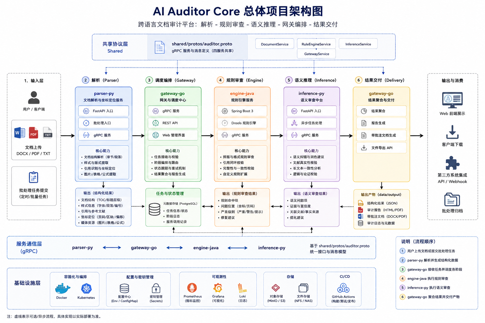

# AI Auditor Core

AI Auditor Core 是一个跨语言文档审计 mono-repo，当前由四个服务和一份共享 gRPC 协议组成，覆盖“解析 - 规则审查 - 语义推理 - 网关编排 - 结果交付”全链路。

## 项目架构图


## 总体说明

仓库当前已经形成稳定的服务边界：

- [services/parser-py](services/parser-py)：文档解析与坐标定位服务，提供 FastAPI、批处理和 gRPC 入口。
- [services/engine-java](services/engine-java)：Java 21 + Spring Boot + Drools 规则引擎，负责格式、引用和完整性审查。
- [services/inference-py](services/inference-py)：Python 语义审查中台，负责纠错、事实核验和长文本一致性扫描。
- [services/gateway-go](services/gateway-go)：Go 网关与调度中心，负责任务编排、状态跟踪、结果聚合与交付。
- [shared/protos/auditor.proto](shared/protos/auditor.proto)：四个服务共享的 gRPC 协议源文件。

## 架构流转

1. 用户上传 DOCX / PDF / TXT，或通过批处理任务提交文档。
2. parser-py 提取章节、样式、引用和坐标信息，生成结构化数据。
3. gateway-go 接收任务并按阶段调度后续审查。
4. engine-java 执行排版规则、引用闭环和完整性校验。
5. inference-py 执行语义纠错、文献真实性校验和逻辑一致性分析。
6. gateway-go 聚合结果，输出 JSON、报告文件和带批注文档到 data/output。

## 当前状态

- parser-py：已有 `main.py`、FastAPI 入口、gRPC 服务和文档处理模块，可通过 `process`、`grpc`、`fastapi` 三种模式运行。
- engine-java：已接入 Spring Boot、Drools、protobuf 代码生成、Spring Batch、Redis、PostgreSQL 与 gRPC 运行时依赖。
- inference-py：已具备 FastAPI、LangGraph、uv、gRPC 和批处理入口，适合承载语义审查与 RAG 检索逻辑。
- gateway-go：已有 HTTP 网关、任务状态管理、Worker、TempManager、监控与编排骨架。
- shared/protos：协议定义是所有服务的唯一接口边界，修改前应优先同步这里。

## 目录概览

```text
.
├── data/
│   ├── input/
│   └── output/
├── services/
│   ├── parser-py/
│   ├── engine-java/
│   ├── inference-py/
│   └── gateway-go/
└── shared/
	└── protos/
```

## 快速开始

前置依赖：Python 3.11+、Java 21 + Maven、Go 1.20+，以及可选的 Docker。

### parser-py

```powershell
cd services/parser-py
python main.py --mode fastapi
python main.py --mode grpc
python main.py --mode process
```

### engine-java

```powershell
cd services/engine-java
mvn clean package
mvn spring-boot:run
```

### inference-py

```powershell
cd services/inference-py
uv venv
uv sync
uv run main.py
```

### gateway-go

```powershell
cd services/gateway-go
go build
go run .
```

## 协议与协作

所有跨服务传输都应以 [shared/protos/auditor.proto](shared/protos/auditor.proto) 为准。新增字段时只允许向后兼容扩展，避免修改已有字段编号。

## 说明

根目录的 [docker-compose.yml](docker-compose.yml) 用于后续统一编排；当前更偏向开发联调和单服务验证，后续可在各服务端口稳定后补齐完整容器化配置。
