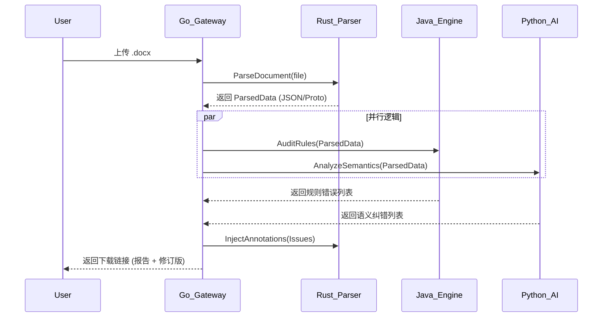

# 📄 需求文档：分布式调度网关与交付中心 (Go 模块)

## 1. 任务概述

成员 D 负责构建系统的“神经中枢”。该模块作为唯一的对外 API 网关，负责接收用户请求、管理长耗时任务的工作流协同（调用 A、B、C 模块）、监控各微服务健康状态，并最终汇总各方数据生成结构化的审查报告与可视化结果。

## 2. 技术栈要求

* **核心语言：** **Golang 1.22+**（利用其极致的并发能力与网络性能）。
* **微服务治理：** **gRPC + Protobuf**（负责与 A、B、C 模块的低延迟通信）。
* **工作流引擎：** **Argo Workflows**（管理复杂的分布式任务状态，确保在某个模块宕机时任务可恢复）。
* **消息队列：** **Redis Streams**（解耦上传请求与后台审查过程）。
* **API 框架：** **Echo**（提供 RESTful 接口）。
* **监控：** **Prometheus + Grafana**（监控全链路耗时）。

---

## 3. 核心功能模块与执行清单

### 模块一：分布式审查编排器 (Audit Orchestrator)

* **需求描述：** 协调 A、B、C 三个模块按逻辑顺序执行。
* **任务拆解：**

1. **串行触发：** 先调用 **成员 A (Rust)** 获取 `ParsedData`。
2. **并行触发：** 将 `ParsedData` 同时分发给 **成员 B (Java)** 和 **成员 C (Python)** 进行规则与语义审查。
3. **结果聚合：** 收集 B 和 C 返回的 `Issue` 列表，剔除重复项并按 `section_id` 排序。

* **执行清单：** 编写基于 Temporal 的工作流定义，实现任务超时控制与重试机制。

### 模块二：异步任务管理系统 (Async Task Manager)

* **需求描述：** 论文审查耗时较长（10s~60s），系统必须支持异步处理模式。
* **任务拆解：**
* 提供 `/upload` 接口返回 `task_id`。
* 提供 `/status/{task_id}` 接口供前端轮询。
* 利用 WebSocket 或 Webhook 在任务完成时通知前端。

* **执行清单：** 实现任务状态机（Pending -> Parsing -> Auditing -> Generating -> Completed）。

### 模块三：报告合成与交付中心 (Report & Delivery Center)

* **需求描述：** 将所有审查结果转化为最终的 PDF 报告及带批注的 Word 文档。
* **任务拆解：**
* **汇总计算：** 根据 B、C 模块传回的 `score_impact` 计算最终合规率。
* **回写触发：** 调用 **成员 A (Rust)** 的回写接口，生成带批注的修订版。
* **报告生成：** 使用 `go-pdf` 或 `templ` 生成包含错误分类统计、合规率曲线图的结构化报告。

* **执行清单：** 设计报告模板，集成数据可视化库。

---

## 4. 系统集成逻辑 (Workflow Sequence)

成员 D 需确保以下调用链路的稳定性：

---

## 5. 关键 API 契约

| 接口 | 方法 | 说明 |
| --- | --- | --- |
| `/api/v1/audit` | `POST` | 提交任务，返回 `task_id` |
| `/api/v1/tasks/{id}` | `GET` | 查询进度（0-100%）与当前状态 |
| `/api/v1/report/{id}` | `GET` | 获取 JSON 格式的完整审查摘要 |
| `/api/v1/download/{id}` | `GET` | 下载打包好的 ZIP（含 PDF 报告与修订 Word） |

---

## 💡 协作建议

**成员 D 请注意：** 你是团队的“质量守门员”。

* **定义标准：** 必须由你牵头制定 `.proto` 协议的更新规则。
* **容错设计：** 考虑到 **成员 C (Python)** 调用的 LLM 可能会超时或报错，你必须在 Go 代码中实现 **Circuit Breaker（熔断器）**。
* **存储安全：** 负责管理 `temp_docs` 共享卷的生命周期，及时清理已完成任务的临时文件，防止磁盘溢出。
  